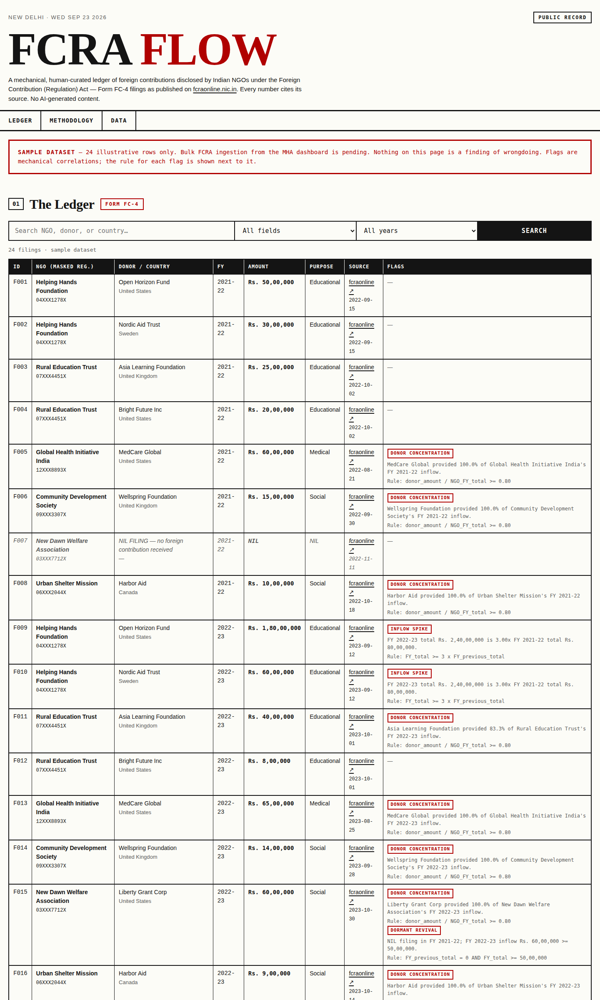

# FCRA FLOW — Foreign Funding Disclosure Tracker

A public-interest OSINT tool tracking India's FCRA foreign-funding disclosures:
which registered NGOs received how much foreign contribution, from which foreign
donors, in which financial year — with mechanical, fully-disclosed anomaly flags.

Same DNA as SIR-WATCH and Bonded-Leader: public disclosure made usable, every
figure traces to a cited source, nothing editorialized. Deliberately different
look: light paper brutalism (Georgia serif masthead, 3px rules, red stamps).

## Sources

- Ministry of Home Affairs FCRA dashboard: https://fcraonline.nic.in/
- Form FC-4: annual return of foreign contribution received and utilised.

## Honest status

**Scaffold with a 24-row sample dataset.** Bulk FCRA ingestion from the MHA
dashboard is future work. Sample registration numbers are masked
(`12XXX1234X` pattern) and sample values are illustrative — any resemblance to
real filings is coincidental until bulk ingestion replaces them with cited
records.

Standing rules (shared with SIR-WATCH): no publishing form-gated datasets
against their terms; no bypassing CAPTCHAs, access controls, logins, or paywalls.

## Mechanical flags

- `SPIKE` — Inflow Spike: `FY_total >= 3 x FY_previous_total`
- `CONCENTRATION` — Donor Concentration: `donor_amount / NGO_FY_total >= 0.80`
- `DORMANT_REVIVAL` — Dormant Revival: `FY_previous_total = 0 AND FY_total >= 50,00,000`

A flag is a mechanical correlation with the rule shown, never a finding of
wrongdoing. Correlation is not causation. See `/methodology`.

## Preview



## Run

```bash
npm install
npm run dev   # http://localhost:3000
npm run build # production build
```

## License

MIT. See LICENSE.
